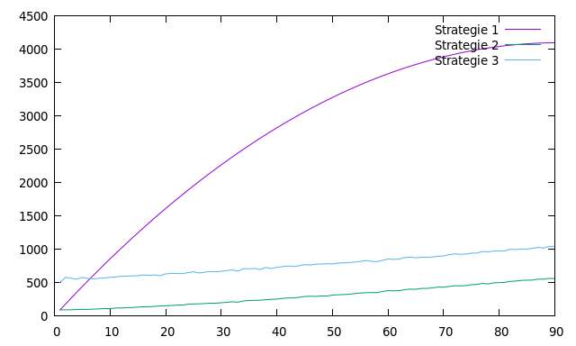

---------------
Experimentateur
---------------

.. toctree::
   :maxdepth: 1

   experience.rst
   marker.rst
   
~~~~~~~~~~
Etat du TP
~~~~~~~~~~

   Ecriture des fonctions negative_markers
        

~~~~~~~~~~~~~~~~~~~~~~
Réponses aux questions
~~~~~~~~~~~~~~~~~~~~~~

Indiquez ici les réponses aux questions posées dans le TP. Vous
reprendrez le numéro de la section et le numéro de la question. Par
exemple pour répondre à la question 3 de la section 2.4 vous
indiquerez.

   
Question 1.2.2
--------------
Pour étudier la complexité de cette algorithme on compte le nombre de comparaison dans la fonction compare entre l'ensemble des markers et les markers positive.Soit 0P cetteopération de comptage du nombre de comparaison.

Question 1.2.3
--------------
Pour cet algorithme nous avons pas de pire et meilleur des cas parceque touts les elements des markers sont compararer avec tout les elements des markers positives jusqu'à la fin des marquers positive et ceux pour touts les valeur m>p;

Question 1.2.4
--------------
Dans le cas generale nous avons donc:

C1(m,p)=(m-1)*(p-1) m>p.

Question 1.3.2
--------------
Il existe un pire des cas pour cet algorithme c'est lorsque tout les marque positive se trouve à la fin de l'ensemble des markers et non trie dans celui ci.

C2(m,p)=1+(n-1)*(log2(n)+1)

Question 1.4.2
--------------
le pire des cas est lorsque tous les markers positive sont a fin de l'ensembles des.

c3(m,p)=p*c(m/p)+m-1

Question 1.5.6
--------------
pour m égale à 10 on constate que la strategie  2 est la meilleur car on amoins de comparaison par rapport au deux qui se croisent en plusieur point. 

Pour m égale à 20 on constate que la strategie  2 est la meilleur car on amoins de comparaison par rapport au deux qui se croisent en deux point.et la première stratégie est plus coûter et fait plus de comparaison.

Pour m égale à 30 on constate que la strategie  2 est la meilleur car on amoins de comparaison par rapport au deux qui se croisent en deux point.et
la première stratégie est plus coûter et fait plus de comparaison.la stratégie 2 s'eloigne de la 3.et se rapproche de la 2.

Pour m égale à 40 on constate que la strategie  3 est la meilleur car on amoins de comparaison par rapport au deux qui se croisent en deux point.et
la première stratégie est plus coûter et fait plus de comparaison.la strat
égie 2 s'eloigne de la 1.et se rapproche de plus en plus de la 3 .

Pour m égale à 50 on constate que la strategie  3 est la meilleur car on amoins de comparaison par rapport au deux qui se croisent en deux point.et
la première stratégie est plus coûter et fait plus de comparaison.la strat
égie 2 s'eloigne de la 1.et se rapproche de plus en plus de la 3 .

Pour m égale à 60 on constate que la strategie  3 est la meilleur car on amoins de comparaison par rapport au deux qui se croisent en deux point.et
la première stratégie est plus coûter et fait plus de comparaison.la strat
égie 2 s'eloigne de la 1.et se rapproche de plus en plus et est presque parallèle à la 3 .

Pour m égale à 70 on constate que la strategie  3 est la meilleur car on amoins de comparaison par rapport au deux qui se croisent en deux point.et
la première stratégie est plus coûter et fait plus de comparaison.la strat
égie 2 s'eloigne de la 1.et se rapproche de plus en plus et est presque parallèle à la 3 .

Pour m égale à 80 on constate que la strategie  3 est la meilleur car on amoins de comparaison par rapport au deux qui se croisent en deux point.et
la première stratégie est plus coûter et fait plus de comparaison.la strat
égie 2 s'eloigne de la 1.et se rapproche de plus en plus et est presque parallèle à la 3 .

Pour m égale à 90 on constate que la strategie  3 est la meilleur car on amoins de comparaison par rapport au deux qui se croisent en deux point.et
la première stratégie est plus coûter et fait plus de comparaison.la strat
égie 2 s'eloigne de la 1.et se rapproche de plus en plus et est presque parallèle à la 3 .

Pour m égale à 100 on constate que la strategie  3 est la meilleur car on amoins de comparaison par rapport au deux qui se croisent en deux point.et
la première stratégie est plus coûter et fait plus de comparaison.la strat
égie 2 s'eloigne de la 1.et se rapproche de plus en plus et est parallèle à la 3 .

